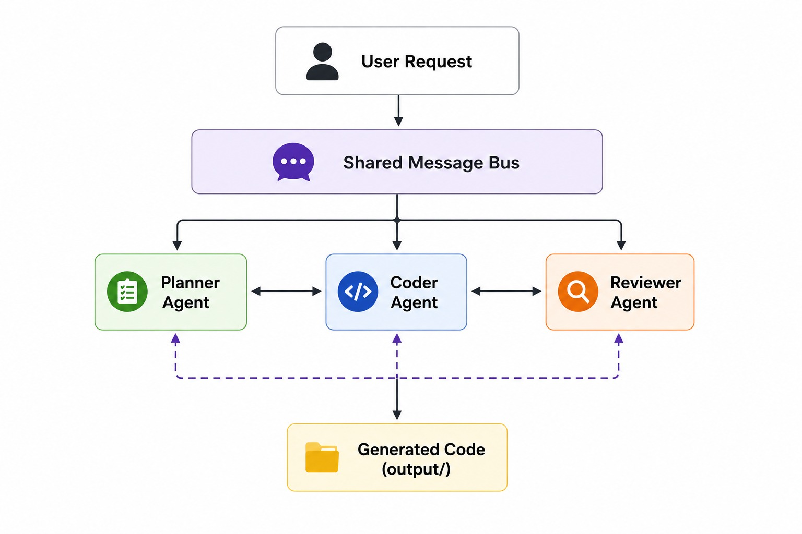

# Full Mesh Multi-Agent Coding System

A Python app using the [OpenAI Agents SDK](https://openai.github.io/openai-agents-python/) where three agents **communicate directly with each other** on a shared message bus:

1. **Planner** — plans the approach and answers questions from teammates
2. **Coder** — implements code and writes files to `output/`
3. **Reviewer** — reviews code and requests fixes via peer messages

## Architecture

```
User Task → TeamBus (shared conversation)
              ↕ talk_to_planner / talk_to_coder / talk_to_reviewer
         Planner ↔ Coder ↔ Reviewer
              ↓
           output/
```


Unlike a simple pipeline, agents **message each other** using `talk_to_*` tools. Each tool sends a direct message to a peer agent and returns their reply. The team collaborates over multiple rounds until the Reviewer says **PASS** or max rounds (6) is reached.

## Quick start (Windows)

```powershell
cd "C:\Users\Downloads\multi Agent"
.\run.ps1 "Create a Python module with a function to compute factorial"
```

On first run, edit `.env` and set your `OPENAI_API_KEY`, then run again.

## Usage

```powershell
python main.py "Create a palindrome checker function"
```

Or interactively:

```powershell
python main.py
```

## How agents communicate

| Tool | Used by | Purpose |
|------|---------|---------|
| `talk_to_planner` | Coder, Reviewer | Ask about requirements or plan |
| `talk_to_coder` | Planner, Reviewer | Discuss implementation or request fixes |
| `talk_to_reviewer` | Planner, Coder | Get review feedback before finalizing |

All messages are recorded on the **TeamBus** and printed to the console.

## Project structure

```
multi Agent/
├── run.ps1                 # One-command launcher (Windows)
├── main.py                 # CLI entry point
├── app/
│   ├── message_bus.py      # Shared TeamBus conversation log
│   ├── mesh_tools.py       # Peer-to-peer talk_to_* tools
│   ├── definitions.py      # Agent factory with mesh tools
│   ├── mesh.py             # Collaboration round loop
│   └── tools.py            # File I/O tools for the Coder
└── output/                 # Generated code (gitignored)
```

## Requirements

- Python 3.10+
- OpenAI API key (`OPENAI_API_KEY` in `.env`)

